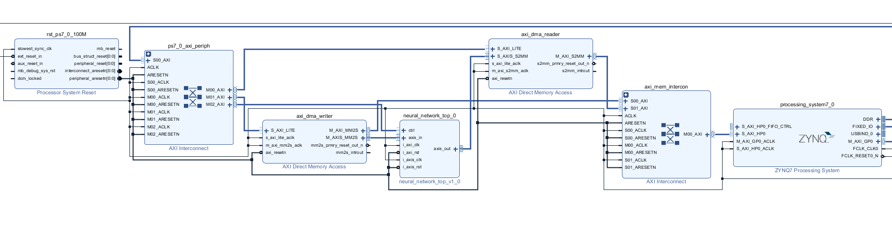

# Connection au fpga avec AXI, DMA

Pour faciliter les tests de réseau à reconnaissance d'images sur FPGA, il est intéressant d'utiliser un fpga PYNQ, qui permet de rouler des notebooks en python sur les cores ARM d'un fpga ZYNQ. Pour connecter ces cores ARM au réseau de neuronne à stimuler, il est pratique d'utiliser le protocole AXI, et d'utiliser un transfer de mémoire DMA. Ceci permettrait d'envoyer des images, et de recevoir les résultats.

## Création de IP

Je me suis basé sur [ce tutoriel](https://www.hackster.io/cospan/create-custom-axi-cores-part-1-straight-to-the-finish-line-a70e5e), ainsi que [le repo](https://github.com/cospan/ip-cores) allant avec celui-ci. J'ai suivi le tutoriel jusqu'à la partie 4, qui permet de créer un ip avec une entrée et sortie avec AXI Stream, et qui contient un fifo. J'ai par la suite modifié le code du fifo du tutoriel, pour rajouter une connection à un wrapper, permettant de recevoir une image, composée de 784 mots de 32 bits, et d'envoyer un résultat de 10 mots de 32 bits.  

Le code vhdl et verilog se trouve [ici](./Pynq/axiNeuralNet/hdl). Présentement le [wrapper vhdl](./Pynq/axiNeuralNet/hdl/neuralNetWrapper.vhd) ne fait que réenvoyer les 10 premiers pixels reçus, permettant de vérifier le fonctionnement.

Pour créer le IP, il suffit de se déplacer dans le répertoire "Pynq/axiNeuralNet" d'effectuer les commandes: "source <chemin vers Xilinx>/Xilinx/Vivado/2020.1/settings64.sh" et ensuite "make" qui devrait ouvrir une fenêtre vivado, permettant de créer le ip, avec les bons ports automatiquement.

## Utilisation du IP créé
  
Pour utiliser le nouveau IP créé, on peut créer un nouveau projet vivado avec la bonne carte PYNQ utilisée, dans mon cas PYNQ-Z1. Par la suite il faut rajouter le IP créé précedemment au projet, en allant dans Project Settings -> IP -> Repository et rajouter le chemin vers le folder [Pynq/axiNeuralNet/hdl](./Pynq/axiNeuralNet/hdl).

Par la suite on peut créer un nouveau block-design, et copier les commandes de [ce fichier](./Pynq/scripts/blockDesign.tcl) dans la console Tcl. Ceci devrait créer le diagramme suivant:

Il faut ensuite créer un wrapper hdl pour ce diagramme, générer un bitstream, et copier le fichier .bit et .hwh généré sur la carte sd du fpga. Le notebook Python [ici](Pynq/notebook/image_transfer/demo_streams.ipynb) permet de tester le fonctionnement.

Pour une certaine raison que je n'ai pas identifié, lorsqu'on essai de recevoir les résultats, dans ce cas-ci les 10 premiers pixels envoyés, il y a 4 lectures faites dans le vide, avant de lire les 10 valeurs. J'ai donc du rajouter une attente de 4 cycles dans [le code du fifo](Pynq/axiNeuralNet/hdl/fifo.v), et 4 valeurs additionnelles dans le tableau qui reçoit les valeurs dans le notebook.

## Ressources
  
[repo GitHub avec un workshop permettant de se familiariser avec PYNQ](https://github.com/Xilinx/PYNQ_Workshop)   
[vidéos YouTube expliquant l'architecture ZYNQ](https://www.youtube.com/watch?v=0Dt8rWJdiJo)  
[tutoriel pour la création du IP](https://www.hackster.io/cospan/create-custom-axi-cores-part-1-straight-to-the-finish-line-a70e5e)
