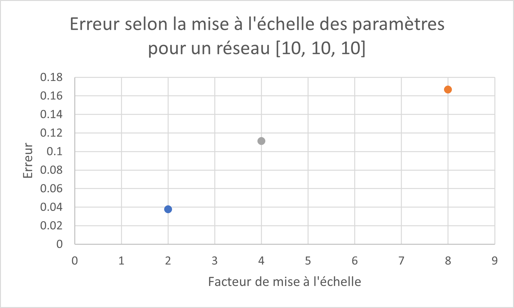
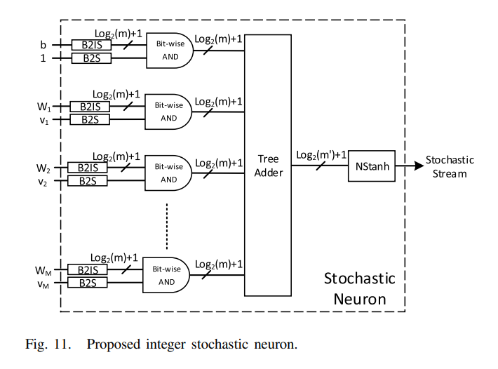
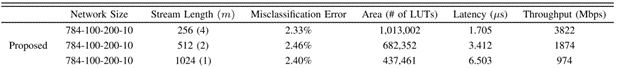

# MLP avec calculs stochastiques

Ce rapport a été écrit lors de mon stage CRSNG, et explique mon processus pour créer un réseaux de neuronnes stochastique.

## Calculs stochastiques

J'ai commencé par tester les différents calculs stochastiques que j'aurais à faire dans le réseau, comme des additions et des multiplications, ainsi que la fonction Tanh, que j'ai comparé aux valeurs obtenues en calculs à virgule flotante.

## Réseau à calculs stochastiques avec format bipolaire

Après avoir vérifier les composantes nécessaires, j'ai commencé par écrire le code VHDL qui me permettrait de générer des réseaux de neuronnes, avec un nombre variable d'entrées, sorties, ainsi que neuronnes dans la/les couches intermédiaires.  

Les entrées du réseau, ainsi que les paramètres, sont donné au réseau en 32-bit, où une valeur de 0x00000000 représente -1, et 0xFFFFFFFF représente 1. Ceci permet par la suite de facilement faire la conversion en nombre stochastique bipolaire, qui est le format stochastique utilisé tout au long du réseau.

Les entrées et tout les paramètres sont converti en nombre stochastique en utilisant le Combined Tausworthe comme générateur de nombre aléatoire. Chaque entrée et paramètre a un générateur unique, avec des valeurs de seeds différentes.

Les additions pour chaque neuronnes sont faites simplement avec un multiplexeur, auquel j'ajoute des entrées nécessaires, forcées à 0, pour avoir un nombre d'entrées qui est une puissance de 2.  

Les multiplications se font avec une porte XNOR.  

### Mise à l'échelle des paramètres

La fonction d'activation de tout les neuronnes est la fonction sigmoide, qui est implémenté avec la fonction STanh, ainsi qu'une addition par 1, encore avec un multiplexeur, qui donne l'équation (1 + tanh(x)) / 2.

Pour mettre à l'échelle l'entrée à cette fonction d'activation, j'utilise le fait que la fonction STanh, soit la fonction Tanh en calculs stochastiques, multiplie les entrées par un entier, qui est controllé par le paramètre N, soit le nombre d'états utilisés, selon l'équation:  

    Stanh(N, x) ~= tanh(x * N/2)

Par exemple, si un neuronne a 4 entrées, l'addition par multiplexeurs donnera un résultat de (x_1 + x_2 + x_3 + x_4) / 4, ou x_1,2,3,4 sont les entrées. Il faut donc anuller cette division par 4, ce qui peut se faire en posant le nombre d'états de la fonction STanh à 8.

En plus de la mise à l'échelle causée par le multiplexeur lors de l'addition, il y aussi potentiellement une mise à l'échelle des paramètres avant d'être encodés sur 32 bits. Par exemple, si un neuronne avait des paramètres sur l'intervalle [-2, 2], il faut les diviser par 2 pour pouvoir les utiliser. On doit donc rajouter ce facteur au nombre d'états de la fonction STanh, et le nombre d'états de la fonction STanh est donc donné par:

    N = (division faite par les additions) * (division des paramètres)

### Méthodologie de tests

J'ai commencé par tester un réseau à deux entrées, une couche cachée de quatre neuronnes et deux sorties, pour évaluer l'erreur causée par l'utilisation de calculs stochastiques. 

J'ai généré les paramètres du réseau aléatoirement, variant de -1 à 1, avec le générateur MersenTwister, avec [ce code C++](MLP/C++/ParamsGen/paramsGen.cpp).
J'ai fait la comparaison entre la simulation du réseau stochastique sur Vivado avec le réseau avec virgules flotantes en utilisant un code C++ qui implémente le même réseau, avec les mêmes paramêtres.
J'ai par la suite fait la même chose avec un réseau à 10 entrées, une couche de 10 neuronnes et 10 sorties, dont le code se trouve [ici](MLP/C++/neuralNetwork_10_10_10.cpp). 

Je voulais par la suite évaluer la performance du réseau pour la reconnaissance de chiffres écrit. J'ai utilisé le code de ce [repo GitHub](https://github.com/mnielsen/neural-networks-and-deep-learning) ainsi que les [explications du même auteur](http://neuralnetworksanddeeplearning.com/), pour trouver entraîner un réseau avec les 784 pixels de l'image en entrée, une couche cachée de 10 neuronnes et 10 neuronnes en sortie. Ce réseau reconnait environ 90% des images tests correctement.

Les paramètres obtenus par l'entrainement du réseau ne donne pas des valeurs contenues dans l'intervalle -1 à 1, donc les paramètres doivent être mis à l'échelle pour pouvoir être convertis en nombre stochastiques de format bipolaire.
J'ai donc divisé les paramètres, soit les weights et bias, par la plus petite puissance de deux qui permet d'avoir des valeurs dans le bon intervalle. Les détails de cet entraînement se trouvent dans [ce fichier](MLP/Python/neural-networks-and-deep-learning/src/trainingTest.py) ainsi que les autres fichiers dans ce répertoire.

Cette mise à l'échelle des paramètres est annulée en la rajoutant au paramètre n de la fonction d'activation STanh.

J'ai ensuite testé le réseau de neuronnes stochastiques en simulation, avec 9 images, et j'ai comparé les résultats donnés par l'implémentation en virgule flotante, encore une fois avec [un code C++](MLP/C++/neuralNetwork.cpp)

### Résultats

Comme je me doutait, l'erreur des sorties augmente lorsque le nombre de neuronnes augmente, ce qui, je pense, est causé par la perte de précision en faisant plus d'additions avec un multiplexeur.

| Entrées - Couche intermédiare - Sorties (# neuronnes) | Erreur moyenne | Erreur maximale            |
|--------------------------|--------------------------------|----------------------------|
| 2 - 4 - 2                | 0.0134                         | 0.0531                     |
| 10 - 10 - 10             | 0.032                          | 0.116                      |
| 784 - 10 - 10            | 0.119                          | 1.000                      |

Dans les images utilisées, le réseau à virgule flotante reconnait correctement tout les chiffres des 9 images, alors que l'implémentation stochastique en reconnait seulement 3. 
Cette perte de performance du réseau stochastique est probablement du au grand facteur de mise à l'échelle causé non seulement par les additions avec multiplexeur, mais aussi la mise à l'échelle des paramètres. Un autre facteur qui pourrait aussi affecter la performance est le fait que la valeur des pixels d'une image varient seulement de 0 à 1. 
Une grande partie des images est complètement noire, soit de 0, ce qui pourrait causer des plus grosses erreurs, du au fait que, selon [cet article](https://ieeexplore.ieee.org/stamp/stamp.jsp?tp=&arnumber=7544366), les multiplications avec une porte xnor ont une plus grosse erreur lorsque les valeurs multipliées sont plus proches de 0.

Après avoir trouvé la performance du réseau, je voulais valider que la performance est négativement affectée par une mise à l'échelle des paramètres. Pour ce faire j'ai repris le réseau à 10 neuronnes en entrées, couche intermédiaire et sortie, et j'ai rajouté une mise à l'échelle de 2, 4 et 8 aux paramètres. J'avais initialement pensé que vu que la précision de STanh augmente lorsque n augmente, cette erreur serait petite, mais ce n'est pas le cas, l'erreur augmente lorsque le facteur de mise à l'échelle augmente.

## Integral Stochastic Computing

Étant donné la performance plutot faible du réseau stochastique pour la reconnaissance de chiffres, je voulais essayer d'éviter la mise à l'échelle causée par les additions avec un multiplexeur. Dans les articles que j'ai lu, où les auteurs avaient obtenus une bonne performance avec un réseau plus gros que celui que j'ai testé, ils n'utilisaient jamais un multiplexeur.  

Par exemple, [cet article](https://doi.org/10.1109/tvlsi.2017.2654298) utilise une différente représentation de nombres stochastiques, qui permet d'éviter la mise à l'échelle, et qui avait obtenu de bons résultats. Les auteurs faisaient aussi la classification de chiffres écrits de MNIST, cependant avec une structure de réseau avec deux couche cachées, une première de 100 neuronnes, et une deuxième de 200, et le même nombre d'entrées, 784, et de sortie, 10. L'entrainement du réseau dans l'article est différent de celui que j'ai fait.

J'ai recréé le fonctionnement du réseau décrit dans l'article, cependant en gardant la même structure de réseau essayée auparavant, soit 784 entrées, une couche de 10 neuronnes, et 10 sorties.

La structure des neuronnes est la même que celle dans l'article: 

  

Cependant, la valeur de mPrime est simplement la valeur maximale des entrées, car je n'avais pas eu le temps de faire un simulation pour déterminer un paramètre adéquat.

Comme dans l'article, j'utilise des LFSR de 11 bits pour la génération de nombres stochastiques. Les entrées du réseau, soit les 784 pixels, utilise des LFSR avec des seeds uniques. Les paramètres, weights et bias, sont générés avec d'autres LFSR avec des seeds uniques. Cependant, tout ces LFSR sont partagés entre les neuronnes. Le nombre de LFSR utilisé est donc: 784 + (785 * m). J'utilisais une fonction en vhdl pour généré les valeurs de seeds nécessaire, mais je n'ai pas réussi à la faire fonctionner en synthèse, j'ai donc simplement généré les valeurs nécessaires en C++, et utilisé comme constantes. 

Similaire au premier réseau, j'utilise la fonction ISTanh, l'équivalent de la fonction STanh avec des nombres stochastiques. Cette fonction est très semblable à celle pour les nombre stochastiques à format bipolaire, et l'équation est:

    IStanh(n * m, x) ~= tanh(x * N/2)

Où (n*m) sera le nombre d'états de la fonction. 

Avec cette fonction, on peut encore un fois faire la mise à l'échelle des paramètres. Cependant, il faut maintenant prendre en compte le paramètre m et mPrime, provenant de l'utilisation de nombre stochastiques intégraux. L'équation pour trouver le nombre d'états pour la fonction selon la mise à l'échelle est maintenant.

    nbr. d'états = (mise à l'échelle * mPrime * 2) / m

### Résultats

Pour tester la performance du réseau sur le dataset MNIST, j'ai suivis les mêmes étapes que pour l'autre réseau. J'ai testé 200 images tests du dataset en simulation. J'ai aussi fait la synthèse du réseau avec Vivado 2020.1. 

|  structure du réseau | Longueur de stream | Paramètres du réseau | LUTS  | Flip-Flops | Erreur de classification (%) |
|---|--------------------|----------------------|-------|------------|------------------------------|
|  784-10-10 |        1024        |    m=1 , mPrime=PasUtilisé              | 97880 |   41840    |             7.5              |

La performance du réseau sur les 200 images testées est semblable à celle du réseau avec virgules flotantes sur l'ensemble des 10 000 images tests, qui était d'environ 92.5%, soit une erreur de 7.5%. 

Je comptais tester le fonctionnement de ce réseau sur le FPGA PYNQ-Z1, comme reporté dans [ce rapport](./Pynq.md). Cependant la carte n'as pas assez de ressources pour l'implémenter. On pourrait donc essayer d'optimiser le code vhdl, diminuer la taille des images, ou essayer un autre FPGA avec les ressources nécessaires.

Je voulais voir si en recréant le même réseau que dans l'article j'obtiendrais sensiblement la même utilisation de ressources. J'ai donc fais la synthèse du réseau 784-100-200-10.

|  structure du réseau | Longueur de stream | Paramètres du réseau | LUTS  | Flip-Flops | Erreur de classification (%) |
|---|--------------------|----------------------|-------|------------|------------------------------|
|  784-100-200-10 |        1024        |    m=1, mPrime=6               | 1081038 |   322308    |          ---         |

En la comparant aux résultats des auteurs, on voit que les ressources utilisé sont environ 2.5 fois plus grande pour la synthèse de mon code vhdl. En fait les ressources utilisés sont plus similaires aux réseau avec m=4. Cela indique donc probablement que mon code vhdl pourrait être modifier pour diminuer les ressources utilisés.

## Ressources
•   Liu, Y., Liu, S., Wang, Y., Lombardi, F., & Han, J. (2021). A Survey of Stochastic Computing Neural Networks for Machine Learning Applications. IEEE Transactions on Neural Networks and Learning Systems, 32(7), 2809–2824. https://doi.org/10.1109/tnnls.2020.3009047  
•   K. Kim, J. Kim, J. Yu, J. Seo, J. Lee and K. Choi, "Dynamic energy-accuracy trade-off using stochastic computing in deep neural networks," 2016 53nd ACM/EDAC/IEEE Design Automation Conference (DAC), 2016, pp. 1-6, doi: 10.1145/2897937.2898011.  
•   Ardakani, A., Leduc-Primeau, F., Onizawa, N., Hanyu, T., & Gross, W. J. (2017). VLSI Implementation of Deep Neural Network Using Integral Stochastic Computing. IEEE Transactions on Very Large Scale Integration (VLSI) Systems, 25(10), 2688–2699. https://doi.org/10.1109/tvlsi.2017.2654298  
•   Nielsen, M. N. (2018). neural-networks-and-deep-learning: Code samples for my book “Neural Networks and Deep Learning.” GitHub. https://github.com/mnielsen/neural-networks-and-deep-learning  
•   Nielsen, M. N. (2015). Neural networks and deep learning. Neural Networks and Deep Learning. http://neuralnetworksanddeeplearning.com/

